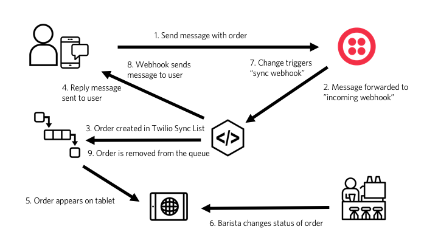

# Twilio Barista

## How does it work?

### 1. Send message with order

A customer sends a message to one of the channels associated to the configured Messaging Service. This can for example happen via SMS to a respective phone number.

### 2. Message forwarded to "incoming webhook"

Twilio will receive this message and do an `HTTP POST` request to the configured webhook URL that has been configured during the setup period. This `HTTP POST` request contains a variety of information including a `Body` property that contains the message sent by the user, `From` the address (e.g. phone number) of the user and the `To` property that contains the address the message was sent to (like the Message Service SID).

The route of the webhook is `/api/webhook/incoming`. The `POST` request is being handled in the [incoming webhook file]. It will perform the following things:

#### a) If the person messages in the first time in a while and there is more than one event with `isVisible` to `true`:

* It will prompt the user which event they are at. It will remember the order until the person picked an event

#### b) The user is already registered for an event or there is only one event:

* parse message to determine intent and which drink is being ordered
* create a [Binding] in [Twilio Notify] for the user
* create an entry in the [Twilio Sync] customer [Map]
* create an entry in the [Twilio Sync] open orders [List]
* create an entry in the [Twilio Sync] all orders [List]
* send reply message to the user via [Twilio Notify]

### 3. Order created in Twilio Sync List

If the user ordered a drink the incoming message webhook will create a new item in the open orders [List] that works like a queue for the orders. The structure of the data added to the queue can be checked out in the [Data Structures documentation].

### 4. Reply message sent to user

The notification is sent to the respective [Binding] using the [Twilio Notify] REST API.

### 5. Order appears on tablet

The order will immediately appear in real-time on the web interface under the `/orders` URL using the [Twilio Sync JavaScript SDK].

### 6. Barista changes status of order

When the barista finished the order they will click one of the two buttons that change the `status` property of that entry in the [List] to `'cancelled'` or `'ready'`.

### 7. Change triggeres "sync webhook"

Twilio will automatically trigger an `HTTP POST` request to the webhook endpoint `/api/webhook/sync` for every change of an item associated to the configured [Twilio Sync] Service. If it's a change in the `status` property of the open orders [List] it will automatically trigger the below actions.

The code for this can be found in the [sync webhook file].

### 8. Webhook sends message to user

In the [sync webhook file] we will then send a notification to the user using the [Twilio Notify] REST API to the respective [Binding].

### 9. Order is removed from the queue

Once the notification was sent, the entry will be removed from the open orders [List] and the entry of the customer in the [Map] will be updated to clear the `openOrders` array of the customer.

[incoming webhook file]: ../server/api/webhooks/incoming.js
[sync webhook file]: ../server/api/webhooks/sync.js
[twilio notify]: https://www.twilio.com/notify
[twilio sync]: https://www.twilio.com/sync
[binding]: https://www.twilio.com/docs/api/notify/rest/bindings
[map]: https://www.twilio.com/docs/api/sync/rest/maps
[list]: https://www.twilio.com/docs/api/sync/rest/lists
[data structures documentation]: DATA_STRUCTURES.md
[twilio sync javascript sdk]: https://www.twilio.com/docs/api/sync/quickstart-js
